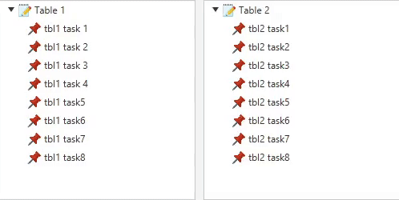

# JavaFX Drag and Drop Demo

Drag'n'Drop from the left table to the right table, sorting inside the right table, no drop back to left table.

## Setup

- Copy [non-modular project](https://github.com/openjfx/samples/tree/master/IDE/IntelliJ/Non-Modular/Maven) from official samples project (Maven in this case).
- Setup additional VM options for your app configuration (see [YT video](https://youtu.be/hS_6ek9rTco)), if needed to run JavaFX correctly.
- Compile with Maven.
- Run main class.

## Usage

As this is a personal sandbox use at your own risk.

## Credits

Based on the old [article](https://brianyoung.blog/2018/08/23/javafx-treeview-drag-drop) and [repository](https://github.com/cerebrosoft/treeview-dnd-example) by Brian Young.

    

